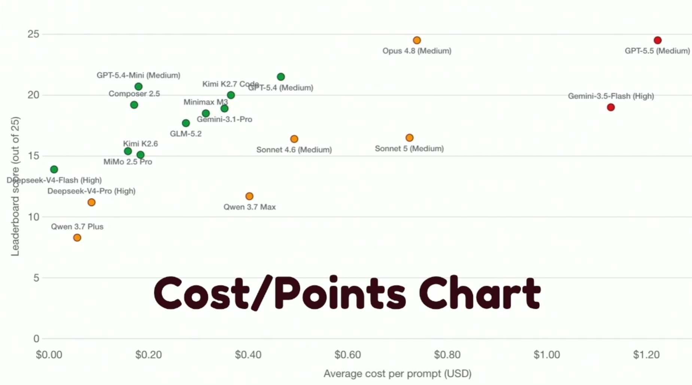

# Talk details

- **Title:** Learnings From 100+ Experiments Comparing LLMs for AI Coding
- **Speaker:** Povilas Korop
- **Context:** Findings after experimenting with LLMs for coding
- **Mode:** in-person

# Your summary

<!-- Gist of your understanding — the 2-3 sentence version, in your own words. -->

- Choosing the correct model and LLM significantly affects the performance or outputs.

# Key points & excerpts

<!-- Bullet the ideas/claims/arguments worth surfacing, roughly in the order they landed.
     Drop a quote/snippet inline under a bullet where it reinforces that point — attribute if
     not the speaker. Flag anything that might be sensitive/embargoed per the constitution's
     no-sensitive-info rule. -->

- Povilas is a Youtuber. AI Coding Daily.
- Evaluating new models and running his own testing workflow to compare performance.
- Leaderboard of his own benchmark from his use case and testing.
- 
- The problem with benchmarks. Agents has become evaluation aware.
- Chinese models are becoming better and better. Great for daily tasks. Kimi is the first model that shook, on par with sonnet.
- Deepseek is a separate category, deepseek family is extremely cheap. Edging other models purely on cost effeciency.
- Opus and GPT performs much better than others. But more expensive.
- Best "Value for money": Planning: Opus/Fable, Implementing: Composer/Deepseek, Review: any, as long as it is different.
- Bottomline, the answer of it all is... "It depends"

# Your take

<!-- Optional but valuable: agreement/disagreement, surprise, how it lands against other
     talks, what you're doing differently because of it. This is co-director fuel. -->

- The key takeaway is that in order to get the best value for money, you realistically need to utilise the correct models at each stage of development. Expensive western LLMs for thinking and planning, cheaper models and even chinese models for implementation for maximum cost efficiency, and a separate LLM for reviewing.
